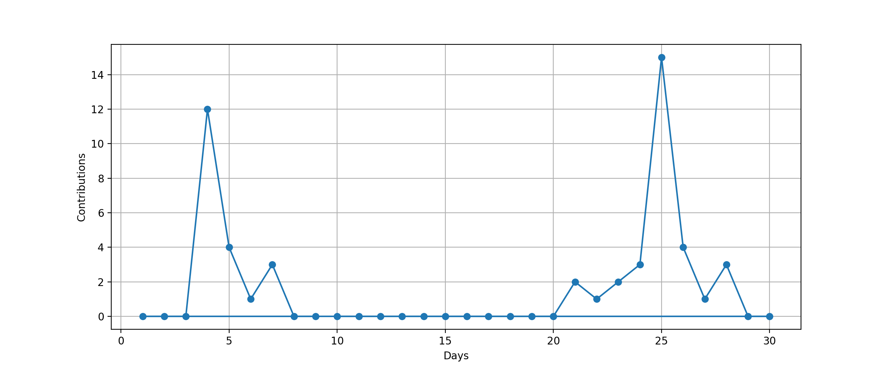
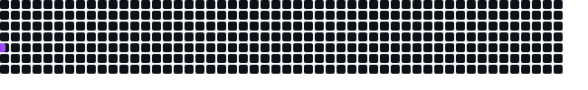

# 👋 Hi, I'm **Rahul Kumar**  

  

## 🌐 Connect With Me

  
  
  
  

---

## 🔥 Contribution Graph

---

## 🐍 Watch my contributions turn into a snake!

---

## 🏆 GitHub Trophies

---

## 🚀 About Me
- 🎓 Computer Science Student  
- 💡 Passionate about **DSA, Web & Open Source**  
- 🛠 Building real-world projects  
- 📌 Always learning new technologies  

---

## 🛠 Tech Stack

**Languages:**

**Web Technologies:**

**Tools:**

---

## 📂 Featured Projects

### ✈️ Airline Reservation System
- Built using **C + Data Structures**
- Used **BST, Linked List, Queue**
- Seat booking & waitlist system  

### 📈 Stock Price Predictor
- Used **LSTM (Deep Learning)**
- Predicts future stock trends  

### 🧭 Shortest Path Visualizer
- Implemented **Dijkstra, BFS, DFS**
- Interactive visualization  

---

## 📊 GitHub Stats

  

  

---
## 🏆 About Rank

**Ranks:** `SSS` `SS` `S` `AAA` `AA` `A` `B` `C` `UNKNOWN` `SECRET`

| Rank | Description |
|------|-------------|
| **SSS, SS, S** | You are at a hard to reach rank. You can brag. |
| **AAA, AA, A** | You will reach this rank if you do your best. Let's aim here first. |
| **B, C** | You are currently making good progress. Let's aim a bit higher. |
| **UNKNOWN (?)** | You have not taken action yet. Let's act first. |
| **SECRET** | This rank is very rare. The trophy will not be displayed until certain conditions are met. |

> 📌 **Note:** The **UNKNOWN** rank is denoted by `?`
>

---
⭐ **If you like my work, give a star to my repositories!**
